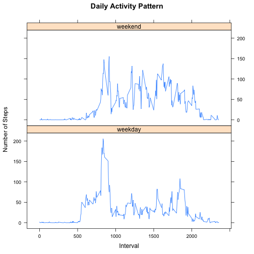

## Loading and preprocessing the data


```r
library(lattice)
library(dplyr)
```

```
## 
## Attaching package: 'dplyr'
## 
## The following objects are masked from 'package:stats':
## 
##     filter, lag
## 
## The following objects are masked from 'package:base':
## 
##     intersect, setdiff, setequal, union
```

```r
setwd("~/Box Sync/Coursera/exdata-031")
dat <- read.csv("activity.csv", colClasses = c("integer", "Date", "factor"))
```

## What is mean total number of steps taken per day?


```r
steps_by_date <- with(dat, split(steps,date))
sum_by_day <- sapply(steps_by_date, sum)
hist(sum_by_day, main = "Distribution of the Number of Steps per Day", xlab="Number of Steps per Day")
```

 

### Mean of the number of steps per day:

```r
mean(sum_by_day, na.rm=TRUE)
```

```
## [1] 10766.19
```

### Median of the number of steps per day:

```r
median(sum_by_day, na.rm=TRUE)
```

```
## [1] 10765
```

## What is the average daily activity pattern?


```r
steps_by_interval <- with(dat, split(steps,interval))
mean_by_interval <- sapply(steps_by_interval, mean, na.rm=TRUE)
intervals <- as.numeric(names(mean_by_interval))

o <- order(intervals)
intervals <- intervals[o]
mean_by_interval <- mean_by_interval[o]


plot(intervals, mean_by_interval, type = "l", ylab="Mean Number of Steps per Day", xlab="Day Interval", main="Daily Activity Pattern")
```

 


### Interval that contains the maximum average number of steps:

```r
names(which(mean_by_interval == max(mean_by_interval)))
```

```
## [1] "835"
```


## Imputing missing values

### Number of missing values in the dataset:

```r
sum(is.na(dat$steps))
```

```
## [1] 2304
```

Let's start by using using the ave function to get the median steps by interval for all records in the dataset. 


```r
median_per_interval <- with(dat, ave(steps, interval, FUN=function(x) median(x, na.rm=TRUE)))
```

We replace all NA values in the dataset by this median by interval.


```r
dat_imp <- dat
na_rows <- which(is.na(dat_imp$steps))
dat_imp$steps[na_rows] <- median_per_interval[na_rows]
```

### Number of missing values in the new dataset:

```r
sum(is.na(dat_imp$steps))
```

```
## [1] 0
```


### What is mean total number of steps taken per day?


```r
steps_by_date <- with(dat_imp, split(steps,date))
sum_by_day <- sapply(steps_by_date, sum)
hist(sum_by_day, main = "Distribution of the Number of Steps per Day", xlab="Number of Steps per Day")
```

 

#### Mean of the number of steps per day:

```r
mean(sum_by_day, na.rm=TRUE)
```

```
## [1] 9503.869
```

#### Median of the number of steps per day:

```r
median(sum_by_day, na.rm=TRUE)
```

```
## [1] 10395
```

We can see that both the mean and median statistics have decreased. This is because by imputing the missing values with the median leads to mean and median being calculated on a greater number of observations (greater n).

## Are there differences in activity patterns between weekdays and weekends?


```r
dat_imp$we <- as.factor(ifelse(weekdays(dat_imp$date) %in% c("Saturday", "Sunday"), "weekend", "weekday"))
dat_imp$interval <- as.numeric(as.character(dat_imp$interval))

xyplot(steps~interval|we, data=arrange(ungroup(summarise(group_by(dat_imp,we,interval), steps=mean(steps))),interval),
    main="Daily Activity Pattern", 
   ylab="Number of Steps", xlab="Interval", type = "l",
   layout=c(1,2))
```

 

We can see that steps are concentrated in the morning and at night buring weekdays whereas steps are more uniformally distributed across the day during the weekends.

